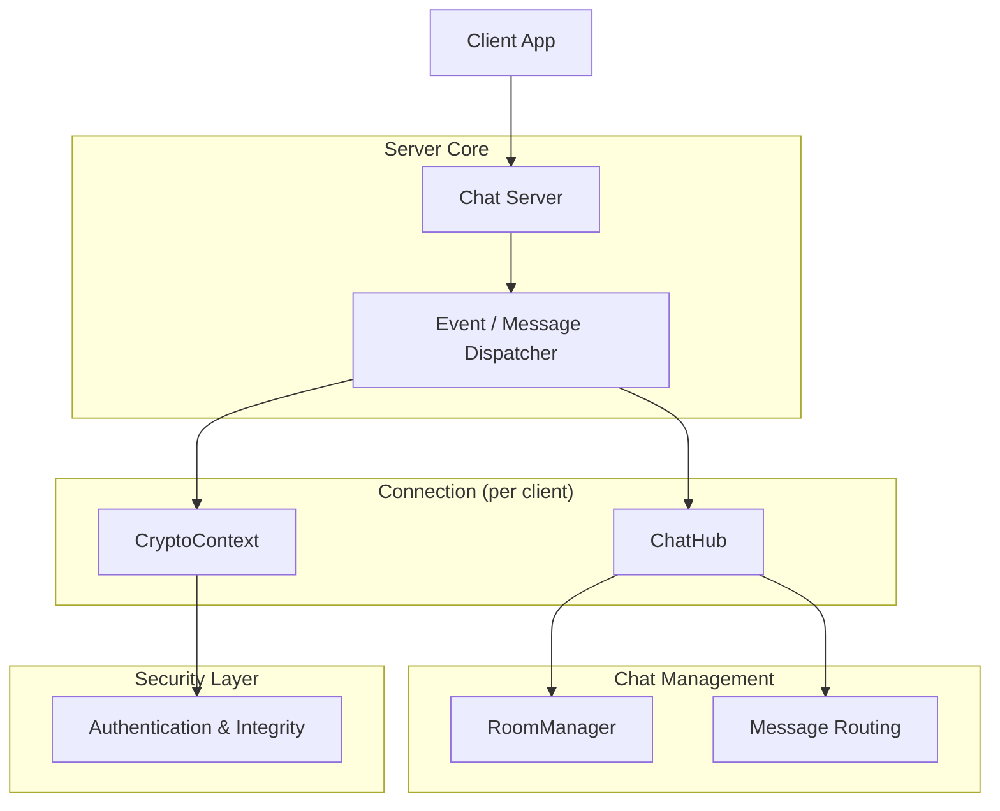

# Encrypted Chatroom

**Encrypted Chatroom** is a high-performance, multi-client TCP chat system written in **C++17** for **Linux**. It showcases how to build a scalable, event-driven server with **end-to-end encrypted messaging**, modular components, and minimal external dependencies.

This project focuses on **systems programming**, **networking**, and **secure protocol design**, without relying on heavy frameworks.

---

## Table of Contents

- [Motivation](#motivation)
- [Features](#features)
- [System Overview](#system-overview)
- [Server Architecture](#server-architecture)
- [Client Overview](#client-overview)
- [Configuration](#configuration)
- [Build and Run](#build-and-run)
- [Testing & Performance](#testing--performance)
- [Documentation](#documentation)
- [Intended Audience](#intended-audience)
- [Future Work](#future-work)
- [License](#license)

---

## Motivation

Modern messaging platforms often hide low-level mechanics behind large abstractions. This project aims to expose the fundamentals of:

- Non-blocking I/O with `epoll`
- Connection lifecycle and protocol design
- Secure encrypted messaging
- Scalable, multi-client architectures

> The goal is to balance **educational clarity** with **practical performance**.

---

## Features

- ✅ Event-driven TCP server (`epoll`)
- ✅ Non-blocking sockets with efficient buffering
- ✅ Custom encrypted application-layer protocol
- ✅ Multi-client, multi-room chat support
- ✅ Per-connection cryptographic state
- ✅ Load testing utilities
- ✅ Modular architecture for future extensions

---

## System Overview

The architecture includes:

- **Client App** – Lightweight terminal-based client
- **Chat Server** – Epoll-based encrypted message router

All data exchange occurs through encrypted frames over TCP.


---

## Server Architecture

- **Epoll Server**: Manages socket readiness, connections, and I/O.
- **Connection**: Maintains per-client state, buffers, and crypto context.
- **ChatHub**: Handles commands, formatting, and routing.
- **RoomManager**: Tracks room membership and handles group delivery.
- **CryptoContext**: Handles encryption, authentication, and replay protection.

Each module follows a single-responsibility design for clarity and extensibility.

---

## Client Overview

The terminal client:

- Connects to the server
- Initializes a secure session
- Sends chat messages and commands
- Decrypts and displays server responses

Lightweight and mirrors server protocol logic without added complexity.

---

## Configuration

The server reads a simple config file with options for:

- Network bind address and port
- Max simultaneous connections
- Cryptographic settings
- Optional key-management endpoint

Allows flexible deployment without recompilation.

---

## Build and Run

### Requirements

- Linux
- C++17-compatible compiler
- OpenSSL development libraries
- CMake + Make

### Build Instructions

```bash
mkdir build && cd build
cmake ..
make
```

### Run

Run the server and clients from the `build/` directory. Usage details are in the `docs/`.

---

## Testing & Performance

Includes test utilities for:

- ✅ Cryptographic correctness
- ✅ Thread-based and `epoll`-based load testing
- ✅ Scalability and latency validation

These tools ensure reliability and performance under load.

---

## Documentation

See the `docs/` directory for detailed guides:

- **Architecture Overview** – Data flow and runtime behavior
- **Cryptographic Design** – Encryption, authentication, replay protection
- **Protocol Specification** – Framing and command structure

---

> ⚠️ Not intended for production deployment.

---

## Future Work

Potential enhancements:

- 🔐 Forward secrecy and key rotation
- 🚀 Lock-free message queues
- 💾 Persistent chat history

---

## License

Released under the [MIT License](LICENSE).
